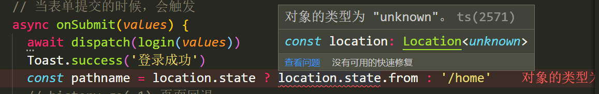

# 项目改造

## 改造建议

1. 项目中使用 TS 时，既可以包含 js 文件，又可以包含 ts 文件

  - `.js`、`.jsx`（使用 JS 时，React 组件对应的文件后缀）
  - `.ts`、`.tsx`（使用 TS 时，React 组件对应的文件后缀）、`.d.ts`

2. 在已有项目中，添加 TS 时的推荐模式

  - 新的功能用 TS
  - 已实现的功能，可以继续保持 JS 文件，慢慢修改为 TS 即可

3. React 组件对应的文件后缀，修改为：`.tsx`
4. 工具函数对应的文件后缀，修改为：`.ts` 或者为其添加类型声明文件 `.d.ts`

## 修改入口文件

### index.ts

- 直接将文件后缀修改为 index.tsx 即可
- 需要重启项目

## 修改App.js

+ 讲App.js 改成app.tsx即可
+ 需要安装react-router-dom的类型

```tsx
yarn add @types/react-router-dom
```

+ 重启

# utils工具函数改造

## history.js

不需要改造，直接把js改成ts即可

## storage.js

+ 讲js改成ts
+ 修改getTokenInfo

```jsx
/**
 * 从本地缓存中获取 Token 信息
 * JSON.parse() 要求参数必须是字符串
 * localStorage.getItem() 返回值可能是字符串，也可能是null，所以会报错
 */
export const getTokenInfo = () => {
  return JSON.parse(localStorage.getItem(TOKEN_KEY) || '{}')
}
```

### 非空断言

[Non-null assertion operator](https://www.typescriptlang.org/docs/handbook/release-notes/typescript-2-0.html#non-null-assertion-operator)

- TS 中提供一个运算符：`!` `非空断言`
  - 如果一个值，它的类型可能是 null 或 undefined，但是，我们在使用时又很确定它的值一定不是 null 或 unde，此时，就可以通过 `非空断言` 来告诉 TS 听哥的，哥很确定它的不是 null 或 undefined
- 注意：**这个操作是风险的**，非空断言，仅仅是让 TS 中的类型检查不再校验 null 或 undefined，但是，如果它的值真的是 null 或 undefined，代码会在运行时报错！！！

### 整体修改

```jsx
// 用户 Token 的本地缓存键名
const TOKEN_KEY = 'geek-itcast-21'
const CHANNEL_KEY = 'geek-itcast-21-channels'
type Token = {
  token: string
  refresh_token: string
}
type Channels = {
  id: number
  name: string
}[]
/**
 * 从本地缓存中获取 Token 信息
 * JSON.parse() 要求参数必须是字符串
 * localStorage.getItem() 返回值可能是字符串，也可能是null，所以会报错
 */
export const getTokenInfo = (): Token => {
  return JSON.parse(localStorage.getItem(TOKEN_KEY)!) || {}
}

/**
 * 将 Token 信息存入缓存
 * @param {Object} tokenInfo 从后端获取到的 Token 信息
 */
export const setTokenInfo = (tokenInfo: Token): void => {
  localStorage.setItem(TOKEN_KEY, JSON.stringify(tokenInfo))
}

/**
 * 删除本地缓存中的 Token 信息
 */
export const removeTokenInfo = () => {
  localStorage.removeItem(TOKEN_KEY)
}

/**
 * 判断本地缓存中是否存在 Token 信息
 */
export const hasToken = (): boolean => {
  return !!getTokenInfo().token
}

/**
 * 保存频道数据到本地
 * @param {*} channels
 */
export const setLocalChannels = (channels: Channels): void => {
  localStorage.setItem(CHANNEL_KEY, JSON.stringify(channels))
}

/**
 * 获取本地的频道数据，，，，，，，如果没有数据，不要默认为空数组
 * @returns
 */
export const getLocalChannels = (): Channels => {
  return JSON.parse(localStorage.getItem(CHANNEL_KEY)!)
}

/**
 * 删除本地的频道数据
 */
export const removeLocalChannels = (): void => {
  localStorage.removeItem(CHANNEL_KEY)
}

```

## request.js改造

讲js改成ts即可

```tsx
async (err: AxiosError<{ message: string }>) => {
    // 如果因为网络原因，response没有，给提示消息
    if (!err.response) {
      Toast.info('网络繁忙，请稍后重试')
      return Promise.reject(err)
    }

```


# 通用组件改造

## Icon组件修改

```jsx
import React from 'react'
import classNames from 'classnames'

type Props = {
  type: string
  className?: string
  onClick?: () => void
}
function Icon({ type, className, ...rest }: Props) {
  return (
    <svg {...rest} className={classNames('icon', className)} aria-hidden="true">
      <use xlinkHref={`#${type}`}></use>
    </svg>
  )
}

export default Icon

```

## typescript中ref的使用

```jsx
const imgRef = useRef<HTMLImageElement>(null)

const current = imgRef.current!
```

## Img懒加载组件修改

```jsx
import classnames from 'classnames'
import { useEffect, useRef, useState } from 'react'
import Icon from '../Icon'
import styles from './index.module.scss'
type Props = {
  src: string
  className?: string
  alt?: string
}
const Image = ({ className, src, alt }: Props) => {
  const imgRef = useRef<HTMLImageElement>(null)
  // 控制是否在加载
  const [loading, setLoading] = useState(true)
  // 控制是否加载失败
  const [error, setError] = useState(false)

  // 加载成功
  const onLoad = () => {
    setError(false)
    setLoading(false)
  }
  const onError = () => {
    setLoading(false)
    setError(true)
  }
  useEffect(() => {
    // 监听图片
    const observer = new IntersectionObserver(([{ isIntersecting }]) => {
      if (isIntersecting) {
        // 图片在可视区
        const current = imgRef.current!
        current.src = current.dataset.src!
        // 取消监听
        observer.unobserve(current)
      }
    })
    observer.observe(imgRef.current!)
  }, [])
  return (
    <div className={classnames(styles.root, className)}>
      {/* 加载中 */}
      {loading && (
        <div className="image-icon">
          <Icon type="iconphoto" />
        </div>
      )}

      {/* 加载出错时显示的内容 */}
      {error && (
        <div className="image-icon">
          <Icon type="iconphoto-fail" />
        </div>
      )}

      
    </div>
  )
}

export default Image

```

## Input组件修改

+ 基本改造

```jsx
import React, { useEffect, useRef } from 'react'
import styles from './index.module.scss'
import classNames from 'classnames'
interface Props {
  extra?: string
  onExtraClick?: () => void
  className?: string
  autoFocus?: boolean
}
export default function Input({
  extra,
  onExtraClick,
  className,
  autoFocus,
  ...rest
}: Props) {
  // focus
  const inputRef = useRef<HTMLInputElement>(null)
  useEffect(() => {
    if (autoFocus) {
      inputRef.current?.focus()
    }
  }, [autoFocus])
  return (
    <div className={styles.root}>
      <input
        ref={inputRef}
        className={classNames('input', className)}
        {...rest}
      />
      {extra ? (
        <div className="extra" onClick={onExtraClick}>
          {extra}
        </div>
      ) : null}
    </div>
  )
}

```

+ 剩余参数的支持

> InputHTMLAttributes中包含了Input框所有能够支持的属性

```jsx
interface Props extends InputHTMLAttributes<HTMLInputElement> {
  extra?: string
  onExtraClick?: () => void
  className?: string
  autoFocus?: boolean
}
```

+ 使用type替代interface

```jsx
type Props = {
  extra?: string
  onExtraClick?: () => void
  className?: string
  autoFocus?: boolean
  type?: 'input' | 'password'
} & InputHTMLAttributes<HTMLInputElement>
```

TS 中的 &（交叉类型）

https://www.typescriptlang.org/docs/handbook/2/objects.html#intersection-types

- 交叉类型：`&`
  - 作用：可以理解为取多个类型的并集
- 联想到了，另一个类型：`|` 联合类型

```ts
// | 在 TS 中表示： number 和 string 两者中出现哪一个都行
type NumStr = number | string

type InputProps = {
  extra?: string
  onExtraClick?: () => void
  className?: string
  dom?: React.RefObject<HTMLInputElement>
}

// & 在 TS 中表示： 最终的类型两者都有
type Props = InputProps & InputHTMLAttributes<HTMLInputElement>
```

交叉类型需要注意的地方：同名的属性容易冲突

使用omit优化

```tsx
type Props = Omit<
  InputHTMLAttributes<HTMLInputElement>,
  'type' | 'autoFocus'
> & {
  extra?: string
  onExtraClick?: () => void
  className?: string
  autoFocus?: boolean
  type?: 'text' | 'password'
}
```

## Textarea组件改造

```jsx
import classNames from 'classnames'
import { TextareaHTMLAttributes } from 'hoist-non-react-statics/node_modules/@types/react'
import React, { useEffect, useRef, useState } from 'react'
import styles from './index.module.scss'
type Props = Omit<
  TextareaHTMLAttributes<HTMLTextAreaElement>,
  'maxLength' | 'value' | 'onChange'
> & {
  maxLength?: number
  className?: string
  value: string
  onChange: (e: React.ChangeEvent<HTMLTextAreaElement>) => void
}
export default function Textarea({
  maxLength = 100,
  className,
  value,
  onChange,
  ...rest
}: Props) {
  const [content, setContent] = useState(value || '')
  const handleChange = (e: React.ChangeEvent<HTMLTextAreaElement>) => {
    setContent(e.target.value)

    onChange && onChange(e)
  }
  const textRef = useRef<HTMLTextAreaElement>(null)
  useEffect(() => {
    textRef.current!.focus()
    textRef.current!.setSelectionRange(-1, -1)
  }, [])
  return (
    <div className={styles.root}>
      {/* 文本输入框 */}
      <textarea
        {...rest}
        className={classNames('textarea', className)}
        maxLength={maxLength}
        value={value}
        onChange={handleChange}
        ref={textRef}
      />

      {/* 当前字数/最大允许字数 */}
      <div className="count">
        {content.length}/{maxLength}
      </div>
    </div>
  )
}

```

## NavBar组件改造

```jsx
import Icon from '@/components/Icon'
import styles from './index.module.scss'
import { useHistory } from 'react-router'
import classNames from 'classnames'
import { ReactNode } from 'react'
// import { withRouter } from 'react-router-dom'
// 1. withRouter的使用
// history match location: 这个组件必须是通过路由配置的  <Route></Route>
// 自己渲染的组件，无法获取到路由信息  <NavBar></NavBar>

// 2. 路由提供了几个和路由相关的hook
// useHistory  useLocation  useParams
type Props = {
  children: string | ReactNode
  extra?: string
  onLeftClick?: () => void
  className?: string
}
function NavBar({ children, extra, onLeftClick, className }: Props) {
  const history = useHistory()
  const back = () => {
    console.log('123')
    // 跳回上一页
    if (onLeftClick) {
      onLeftClick()
    } else {
      history.go(-1)
    }
  }
  return (
    <div className={classNames(styles.root, className)}>
      {/* 后退按钮 */}
      <div className="left">
        <Icon type="iconfanhui" onClick={back} />
      </div>
      {/* 居中标题 */}
      <div className="title">{children}</div>

      {/* 右侧内容 */}
      <div className="right">{extra}</div>
    </div>
  )
}

export default NavBar

```

## AuthRoute组件改造

https://stackoverflow.com/questions/53104165/implement-react-router-privateroute-in-typescript-project/53111155#

```jsx
import { hasToken } from '@/utils/storage'
import { Route, Redirect, useLocation, RouteProps } from 'react-router-dom'
interface PrivateRouteProps extends RouteProps {
  component: React.ComponentType<any>
}
export default function AuthRoute(props: PrivateRouteProps) {
  const { component: Component, ...rest } = props
  const location = useLocation()
  // console.log(location)
  return (
    <Route
      {...rest}
      render={() => {
        if (hasToken()) {
          return <Component></Component>
        } else {
          return (
            <Redirect
              to={{
                pathname: '/login',
                state: {
                  // 从哪儿来的
                  from: location.pathname,
                },
              }}
            ></Redirect>
          )
        }
      }}
    ></Route>
  )
}

```

# 页面改造

## Layout组件

直接把js改成tsx

# Login组件

### location的处理



+ 关于useLocation的使用

```jsx
type LocationState = {
  from: string
}

const location = useLocation<LocationState>()
```

https://stackoverflow.com/questions/61668623/react-typescript-correct-type-for-uselocation-from-react-router-dom

### redux-action修改

+ 修改action/login.js

```jsx
import request from '@/utils/request'
import { setTokenInfo, removeTokenInfo } from '@/utils/storage'
import { Dispatch } from 'redux'
type Token = {
  token: string
  refresh_token: string
}
export const sendCode = (mobile: string) => {
  return async () => {
    // 发送请求
    await request({
      url: '/sms/codes/' + mobile,
      method: 'get',
    })
  }
}

export const saveToken = (payload: Token) => {
  return {
    type: 'login/token',
    payload,
  }
}

/**
 * 登录功能
 * @param {*} data
 * @returns
 */

export const login = (data: { mobile: string; code: string }) => {
  return async (dispatch: Dispatch) => {
    const res = await request({
      method: 'post',
      url: '/authorizations',
      data,
    })
    // 保存token到redux中
    dispatch(saveToken(res.data))
    // 保存到本地
    setTokenInfo(res.data)
  }
}

/**
 * 退出
 * @returns
 */
export const logout = () => {
  return (dispatch: Dispatch) => {
    removeTokenInfo()
    dispatch({
      type: 'login/logout',
    })
  }
}

```

+ Dispatch的分析

索引签名

- [索引签名](https://www.typescriptlang.org/docs/handbook/2/objects.html#index-signatures)
- 语法：`[key: string]: any`
- 应用场景：我要使用一个对象类型，但是，我不确定对象中有什么属性，此时，就可以使用索引签名类型了

```ts
// 可以将这个内容分为两部分，
//  冒号前面 `[extraProps: string]` 表示对象中的属性类型 - 键
//  冒号后面 `any` 表示属性值的类型 - 值

// [extraProps: string] 表示：
//  extraProps 是一个任意合法属性名称，比如，可以叫：k 或 key
//  : string 表示对象属性的类型是 字符串 类型

// 注意：一个对象，它的属性类型可以是： string | number | symbol
interface AnyAction {
  [extraProps: string]: any
}

export interface AnyAction extends Action {
  // Allows any extra properties to be defined in an action.
  [extraProps: string]: any
}
```


### redux-reducer修改

```jsx
type Token = {
  token: string
  refresh_token: string
}
type ActionType = {
  type: 'login/token' | 'login/logout'
  payload: Token
}
const initValue: Token = {
  token: '',
  refresh_token: '',
}
export default function reducer(state = initValue, action: ActionType) {
  const { type, payload } = action
  if (type === 'login/token') {
    return payload
  }
  if (type === 'login/logout') {
    return {}
  }
  return state
}
```

### 类型提取

+ types.d.ts

```jsx
/**
 * token的类型
 */
export type Token = {
  token: string
  refresh_token: string
}

```


# Profile组件改造

## 修改redux


## 泛型工具类型 - ReturnType

- 泛型：

```ts
function id<Type>(value: Type): Type {
  return value
}

// 尖括号中出现的是 类型
id<number>(1)
id<string>(1)
```

- ReturnType
  - 作用：**用来获取函数返回值的类型**

```ts
const fn = () => 10

// typeof fn 的结果： () => number
// R1 => number
type R1 = ReturnType<typeof fn>
// type R1 = ReturnType<() => number>
```

## 获取redux状态的类型

https://redux.js.org/usage/usage-with-typescript

+ 讲store/index.js修改为store/index.ts

```jsx
// 参数1：reducer
// 参数2：指定store的初始值
// 参数3：指定中间件
const store = createStore(
  reducer,
  {
    login: getTokenInfo(),
  },
  composeWithDevTools(applyMiddleware(thunk))
)

export type RootState = ReturnType<typeof store.getState>
```

## useSelector 的类型

```ts
// 在 TS 中 useSelector 是一个泛型函数，并且它有两个泛型变量，分别是：
// 1 整个Redux应用的状态类型
// 2 当前要获取的状态类型
// 因此，在使用的时候，需要传入两个 泛型变量：
// 比如，以下代码中，
// 第一个传入了 AppState 也就是整个 Redux 应用的状态类型
// 第二个传入了 AppState['profile'] 也就是当前要获取的 profile 状态的类型

const user = useSelector<RootState, RootState['profile']>(
  (state) => state.profile.user
)
```


## TS 中的索引查询类型

- 语法：`对象类型[键]`
- 作用：查询 对象类型 中某个属性对应的类型

```ts
type A = {
  name: string
}

// NameType => string
type NameTyep = A['name']
```

## 修改aciton

